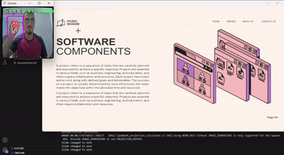
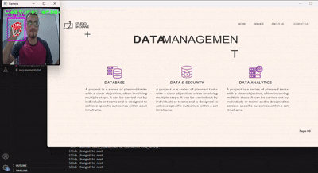
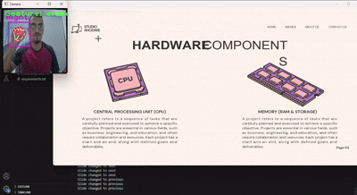
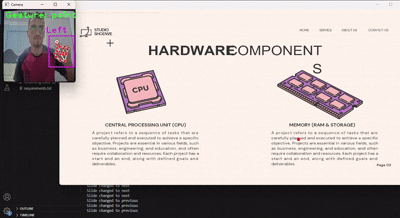
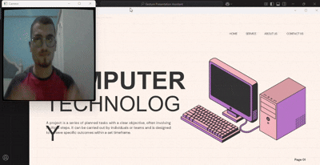
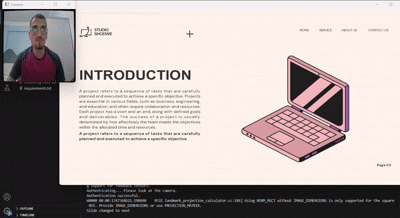
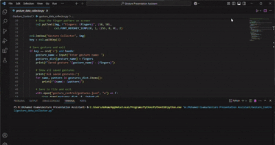

# Gesture Presentation Assistant

The **Gesture Presentation Assistant** is an intelligent system that enables users to control presentation slides using hand gestures. This is particularly useful in hands-free or remote presentation environments. The system integrates facial authentication, camera calibration, gesture recognition, and real-time feedback mechanisms.

## 📦 Features

### 🔐 **Facial Authentication**: 
#### Secure user login using facial recognition.


### ✋ **Gesture Recognition**: 
#### Detects and interprets hand gestures from the user.
  - #### 1. 👉 Next Slide
      Raise only the pinky finger to navigate to the next slide.  
      

  ---

  - #### 2. 👈 Previous Slide
      Thumb finger up while the rest are down.  
      

  ---

  - #### 3. 🖱️ Pointer Mode
      Raise the index finger while keeping the rest down to move the mouse cursor.  
      

  ---
  - #### 4. 🖊 Draw Mode
      Raise the index finger and middle finger to draw points.  
      

  - #### 5. 🔍 Zoom In/Out
      Raise thumb, index, and middle fingers on both hands and move hands together/apart.  
      

  - #### 6. 🤚 End Slides
      Raise all fungers to end slides.
      

### 🆕 **Gesture Data Collector**: Catch a new hand desture and add it in the JSON file.
 - 

### 🗣️ **Feedback System**:
  - **Visual Feedback**: UI responses to gestures.
  - **Voice Feedback**: Audio responses to confirm actions.
### 📽️ **PowerPoint Integration**: Seamless slide control using gestures.
### 🎯 **Camera Calibration**: Enhances gesture detection accuracy.

## 📁 Project Structure

```
Gesture Presentation Assistant/
│
├── main.py                        # Entry point of the application
├── README.md                      # Project description (you are reading it!)
├── requirements.txt               # Python dependencies
├── Gesture Presentation Assistant.pptx # Demo presentation file
│
├── Authentication/
│   └── authenticator.py          # Facial recognition module
│
├── Calibration/
│   ├── camera_calibration.py     # Camera calibration script
│   └── calibration_data.npz      # Calibration data
│
├── Feedback/
│   ├── visual_feedback.py        # Visual feedback handler
│   └── voice_feedback.py         # Voice feedback system
│
├── Gesture_Control/
│   ├── gestures.json             # Configuration for gestures
│   ├── gesture_data_collector.py # Utility for collecting gesture data
│   └── gesture_detector.py       # Main gesture detection logic
│
└── media

```

## 🚀 Getting Started

### Prerequisites

- Python 3.10 or later
- A webcam
- Microphone and speakers (for voice feedback)

### Installation

```bash
git clone https://github.com/MohamedOsama16/gesture-presentation-assistant.git
cd gesture-presentation-assistant
pip install -r requirements.txt
```

### Running the Application

```bash
python main.py
```

## 📚 Usage

1. Authenticate using your registered face.
2. Calibrate the camera if running for the first time.
3. Use hand gestures to control slide transitions.
4. Get immediate visual and/or voice feedback on your actions.

## 🧠 Technologies Used

- OpenCV
- NumPy
- Mediapipe / pyttsx3
- Deepface

## 👤 Author

- Mohamed Osama 

## 📜 License

This project is licensed under the MIT License. See `LICENSE` for details.
